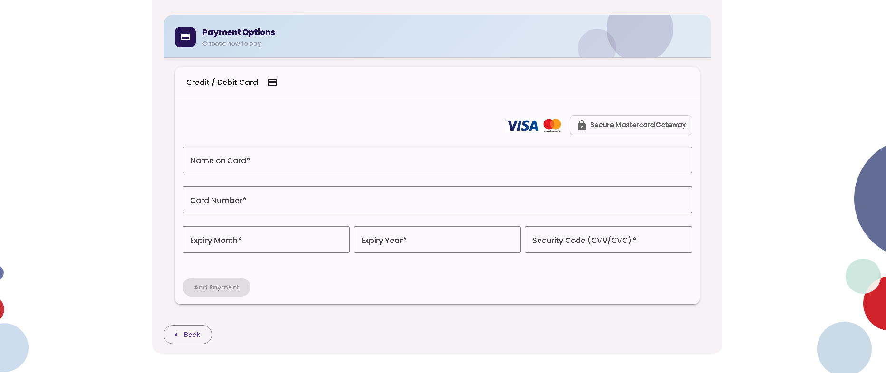

# STO Integration

## Current behaviour

STO creates and groups orders into a checkout page. The user places items into a cart. STO
translates each cart into a separate order.

STO processes payment for each order as a separate transaction. STO sends each transaction to:

1. **PGW** — for payment processing.
2. **BM** — for payment data update.

When the user navigates to the checkout page, STO queries PGW for the available payment methods.
PGW currently returns only **MPGS**. STO shows the payment section for the returned payment
method, with no payment method choice.

The image below shows the current payment section of the checkout page.

## Proposed changes

PGW must return both **MPGS** and **PayPal Pay in 4** as available payment methods, when STO
queries PGW on checkout navigation.

STO must add a payment method selection button above the payment section, based on the payment
methods PGW returns. The user must first choose one of two options:

1. **Credit card payment**.
2. **PayPal Pay in 4**.

### Credit card payment

If the user chooses credit card payment, STO must render the current payment section, shown in
the image above. The checkout workflow must stay the same as the current workflow, for all
remaining pages.

### PayPal Pay in 4 payment

If the user chooses PayPal Pay in 4, STO must render the PayPal Pay in 4 button from the
Braintree SDK, in place of the current payment section. A new workflow must take place.

> More details about the new PayPal workflow will follow.
